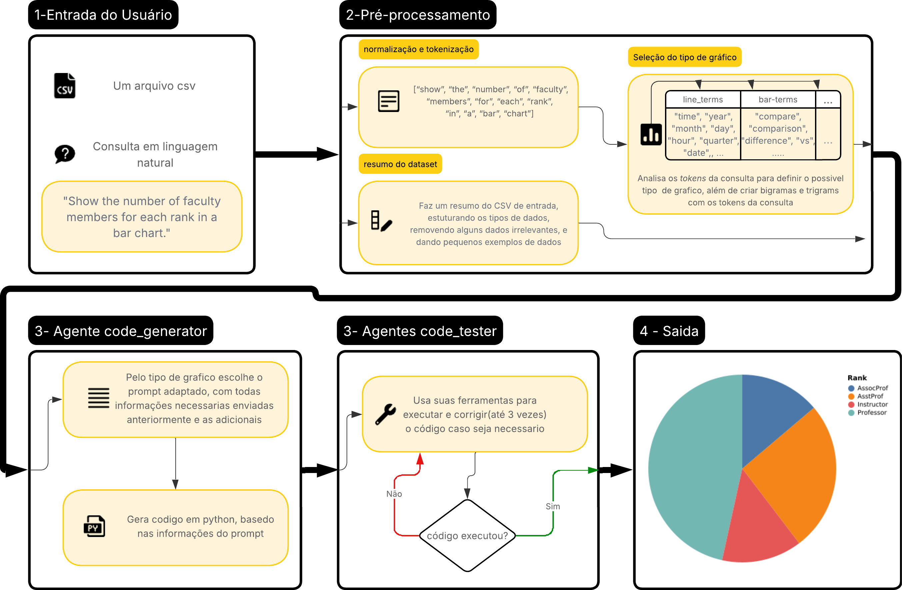

# 📊 GraphMatch


---

## 📌 **Descrição Geral**

**GraphMatch** é um sistema NL2Vis (Natural Language to Visualization) que traduz consultas em linguagem natural em visualizações de dados interpretáveis, executáveis e semanticamente coerentes.
O projeto combina análise linguística determinística com geração de código assistida por LLMs, abordando os maiores pontos de falha identificados na literatura: **pré-processamento e seleção de dados**.

---

## 🧠 **Resumo da Ferramenta**

A visualização de dados é essencial para análise exploratória, mas LLMs ainda cometem erros frequentes ao interpretar consultas visuais, especialmente na escolha de colunas, eixo Y, filtragens e transformações. Estudos mostram que **73,8% dos erros** em NL2Vis ocorrem na etapa de manipulação dos dados.

O **GraphMatch** corrige isso por meio de:

* **Tokenização e anotação semântica** da consulta
* **Seleção robusta de colunas relevantes**
* **Desambiguação do tipo de gráfico**
* **Geração estruturada e executável de código Altair**
* **Correção automática em caso de erros**
* Pipeline mais **interpretável**, auditável e seguro

Suporta **gráficos básicos** (linha, barra, pizza, dispersão e boxplot) para prova de conceito.

---

## 🗂️ **Estrutura do Projeto**

```
graphmatch/
│── app.py                 # Interface principal da aplicação
│── chart_generator.py     # Agente gerador de gráficos (uso independente)
│── pre_processing.py      # Faz o pré processamento da consulta
│── chart_type.py          # Parte deterministica de seleção do gráfico
│── dataset_summary.py     # Faz po resulmo da tabela de entrada
│── requirements.txt       # Dependências
│── viseval_dataset.zip    # Dataset para avaliação (deve ser descompactado)
│── README.md
```

---

## 🖼️ **Fluxo do Sistema**




---

## 🛠️ **Tecnologias Utilizadas**

* **Python 3.10+**
* **NLTK** para tokenização e PLN
* **LangChain** para orquestração do LLM
* **GPT-4o-mini** para geração de código
* **Pandas** para manipulação de dados
* **Altair** para geração dos gráficos
* Outras dependências listadas em `requirements.txt`

---

## ▶️ **Como Executar**

### **1. Instalar dependências**

```bash
pip install -r requirements.txt
```

### **2. Executar a aplicação**

```bash
python app.py
```

### **3. Usar os agentes isoladamente**

```python
from chart_generator import ChartGeneratorAgent
```

---

## 🧪 **Avaliação com VisEval**

Para reproduzir os experimentos:

1. Descompacte `viseval_dataset.zip`
2. Certifique-se de que a pasta está no diretório raiz
3. Execute o módulo de avaliação (se tiver um script específico, posso incluir aqui)

---

## 👤 **Autor**

**Otávio Augusto Trindade Fonseca**

---
